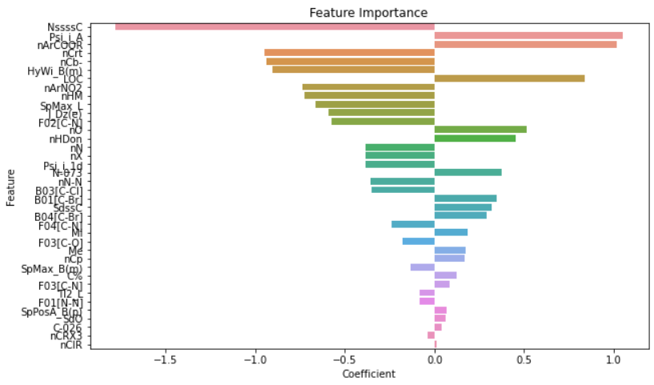

# QSAR biodegradation
Classification and prediction of biodegradable or non-biodegradable compounds using QSAR data.
## Motivation
 The objective of this project is to leverage QSAR-Data (Quantitative Structure-Activity Relationship) derived from chemical compounds to classify substances as either biodegradable or non-biodegradable. Given that degrading compounds may take an extensive amount of time for decomposition, traditional degradability experiments can be time-consuming. This is where the QSAR approach demonstrates its effectiveness. By examining readily obtainable molecular properties, we can estimate the behavior of molecules, specifically their biodegradability. This estimation offers a swift and cost-effective alternative to time-intensive experiments, facilitating proper chemical disposal practices. In doing so, this project contributes to environmental preservation, ensuring responsible chemical management and minimizing the need for expensive long-term experiments.

 In this project we will carry out several steps from our dataset :
 * Data pre-processing with the import of libraries, the cleaning of the dataframe, and normalization
 * Data visualization using matplotlib and seaborn to show the degradable or non-degradable behavior of the compounds
 * Modeling with the exploration of multiple classification models like logistic regression and KNN
 ## Dataset
 Dataset used : QSAR biodegradation

 Data set containing values for 41 attributes (molecular descriptors) used to classify 1055 chemicals into 2 classes (ready and not ready biodegradable).
 The data have been used to develop QSAR (Quantitative Structure Activity Relationships) models for the study of the relationships between chemical structure and biodegradation of molecules.
 
 The Dataset can be found here : https://archive.ics.uci.edu/dataset/254/qsar+biodegradation
## Data pre-processing
we started by naming each column because they did not have a description in the dataset then by looking at the types of values ​​contained in the dataset we realized that there is only one object column which is actually the experimental class column. This is our target. We have also noticed that there is no missing value in the dataset. In order to facilitate classification through our different models we have also ensured that the target class will be expressed as integers. So NRB which means Not Biodegradable is represented by a 0 and RB (Biodegradable) is represented by a 1. Finally we normalized the dataset.

## Data visualization
We wanted to know the exact value for the ditribution of the target classes is. We obtained :
* For 0 => NRB (non-degradable) constitutes approximately 66.26% of the entries
* For 1 => RB (degradable) constitutes approximately 33.74% of the entries

These percentages provide insights into the class distribution in the "degradable" column of the dataset. In this case, it suggests that the dataset is somewhat imbalanced, with the non-degradable class being more prevalent than the degradable class. Understanding class distribution is important, as imbalances can impact the performance of machine learning models. In this case, the imbalance is quite small, so we decide to keep it. For this part, the dataset was partitioned into two target classes: "degradable" and "non-degradable," aiming to identify features exhibiting notable distinctions between these two groups. Then we dropped from the dataset the columns : "SM6_L","SpMax_A","SM6_B(m)“ because of the highly correlations between variables (|r| > 0.90). Once the figures are displayed, the distribution show that the best prediciting features for class seperation are:
* SpPosA_B(p)
* HyWi_B(m)
* C%
* SpMax_B(m)
* SpMax_L

## Modeling
For modeling we tested three different models based on train_test_split : random, logistic regression and KNN. For each model we display the normalized confusion matrix obtained using y_test and y_pred. To explain the results of the above model classification, we wanted to analyze the performance metrics of each model. Here are the key metrics:

1. Accuracy: It measures the overall correctness of the model's predictions. It is calculated as the ratio of correctly classified instances to the total number of instances.
2. Precision: It measures the proportion of true positive predictions out of all positive predictions. It indicates how well the model identifies the positive class.
3. Recall: It measures the proportion of true positive predictions out of all actual positive instances. It indicates how well the model captures the positive class.
4. F1 Score: It is the harmonic mean of precision and recall. It provides a balanced measure of the model's performance by considering both precision and recall.

By analyzing these metrics for each model, we can assess their effectiveness in classifying the target variable. The model with higher accuracy, precision, recall, and F1 score is considered better in terms of classification performance.

  
We can see that the best model tested for this classification problem is the Logistic regression model.

  Finally we have chosen the logistic regression model is chosen, since it provides the overall best performance.

         
  

The overall model performance provides a good classification of the target degradability. The most import metric being the accuracy score. The obtained accuracy score states that using this model 85% of all compounds to be classified as degradable are truly degradable.

The logistic regression model's nature allows for a more in-depth exploration of the relationship between the utilized features and the classification:

  

## Application
The OECD offers ample data on chemical compounds that can be readily scraped for future analysis. This presents an opportunity to enhance model performance.

On an industrial scale, this model could be applied to:

* Innovate Biodegradable Compounds:
Utilize the feature importance insights to create novel biodegradable compounds, leveraging the identified influential features.

* Laboratory Testing for Waste:
Conduct laboratory tests on waste materials to ascertain their compostability, providing a practical application for the model in waste management.

* Certification of Biodegradable Products:
Certify products as biodegradable based on compound data, offering a valuable contribution to environmentally conscious product labeling and certification efforts.

 

 

